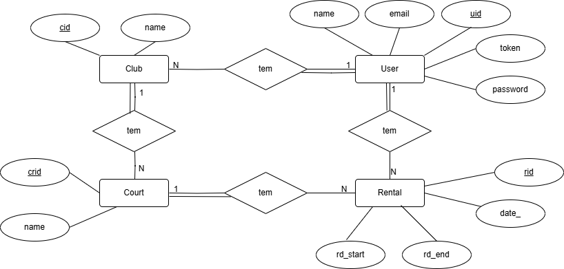

# LS Project - SPA and Web API for Padel Clubs Management System

## Introduction

This document contains the relevant design and implementation aspects of LS project's first phase.

## Modeling the database

### Conceptual model ###

The following diagram holds the Entity-Relationship model for the information managed by the system.

We highlight the following aspects:

Our data model consists of four entities: `User`, `Club`, `Court`, and `Rental`, each with the following attributes:

- **`User`**: `uid`, `name`, `email`, `token`, `password`.
- **`Club`**: `cid`, `name`, `owner`.
- **`Court`**: `crid`, `name`, `club_id`.
- **`Rental`**: `rid`, `date_`, `rd_start`, `rd_end`, `renter_id`, `court_id`.

These attributes are directly mapped to database tables.

#### Relationships

The relationships between these entities are defined as follows:

- `User` has a **one-to-many** relationship with `Club`, meaning a user can be associated multiple clubs.
- `User` has a **one-to-many** relationship with `Rental`, allowing a user to have multiple rentals.
- `Club` has a **one-to-many** relationship with `Court`, meaning a club can have multiple courts.
- `Court` has a **one-to-many** relationship with `Rental`, meaning a court can have multiple rentals.

#### Database Mapping

To map these relationships to the database, we follow the hierarchy of dependencies:

- `Club` has a foreign key `owner`, referencing the `User` entity.
- `Court` has a foreign key `club_id`, referencing the `Club` entity.
- `Rental` has foreign keys `court_id`, referencing the `Court` entity, and `renter_id`, referencing the `User` entity.

The conceptual model has the following restrictions:

* The email of a user is unique. 
* The name of a club is unique.
* The crid of a court is unique.
* The rid of a rental is unique.
* There's no attribute that can be null in the database.

### Physical Model ###

The physical model of the database is available in [DataBase Model](../src/test/sql/createSchema.sql).

## Software organization

### Open-API Specification ###

[OpenApi Specification](./openapi.yaml)

In our Open-API specification, we highlight the following aspects:

Our endpoints are organized in the following way:
* `/users` - User management
* `/clubs` - Club management
* `/clubs/{cid}/courts` - Court management
* `/clubs/{cid}/courts/{crid}/rentals` - Rental management

All endpoints that make changes to the database require authentication, which is done 
through a token passed in the request header. The token is generated when a user logs in.

We also specify the actual dto classes that are used in the by our webApi.

### Request Details

The request flow in our system follows a structured pattern through several layers:

* `Web API Layer`: Receives and processes HTTP requests
* `Service Layer`: Handles business logic
* `Repository Layer`: Manages data access
* `Database`: Stores and retrieves data

The request follows this path:

* The HTTP request is received by the relevant WebApi class, where path and query parameters are extracted and validated
* Request logging, error handling and Token validation are applied through functions from the Utils Class
* The request is transformed into domain model parameters forcing rules and constraints
* The service layer is called to execute logic and interacts with repositories through transaction management
* Results are converted to DTOs and returned as HTTP responses

### Connection Management

The database connection is created at server startup using a URL obtained from an environment variable. This connection is then passed to the `TransactionManager`, which manages it across the JDBC repositories.

For simple operations requiring only one query, the `autocommit` property, with its default value set to `true`, ensures that each statement is automatically committed.

For complex operations involving multiple queries, `autocommit` is disabled, and the transaction level is set to `SERIALIZABLE` to prevent conflicts with concurrent transactions. This logic is encapsulated in the `executeMultipleQueries` function, which follows a try-catch-finally approach:

- **try** → Executes queries and manually commits if successful.
- **catch** → Rolls back in case of failure.
- **finally** → Restores properties to their default values.

In both cases, `Statement` and `ResultSet` are managed using Kotlin’s `.use {}` function, ensuring they are automatically closed after being processed.

The connection remains open until the server stops, at which point it is closed.

### Data Access

The data access layer is implemented using the Repository pattern. 
The interfaces below establish the contract for the repositories:
* `UserRepository`
* `ClubRepository`
* `CourtRepository`
* `RentalRepository`

The `Transaction` interface centralizes all repositories, providing a unified access 
point for database operations. The `TransactionManager` interface manages transactions, 
offering the run method, which executes a given block of repository operations within 
a transactional context.

We have the following implementations, for the test of the data access layer:
* `UserRepositoryInMem`
* `ClubRepositoryInMem`
* `CourtRepositoryInMem`
* `RentalRepositoryInMem`

* And the following implementations, for the actual data access layer:
* `UserRepositoryJdbc`
* `ClubRepositoryJdbc`
* `CourtRepositoryJdbc`
* `RentalRepositoryJdbc`

To simplify the SQL statements, a consistent design approach was adopted by using a generic `SELECT` format, where column aliases define a dictionary-like mapping for the returned values in a result set. This provides a uniform way of accessing query results, regardless of the specific query. This pattern is used throughout all JDBC repositories.
In operations that return a list of elements, the results are wrapped in a `PaginationInfo` instance. The first property, `items`, contains the paginated list of elements, determined by skip and limit values, and the second property, `count`, has the total amount of elements in the database for the search criteria, regardless of pagination.
For row insertions, SQL's `ON CONFLICT` clause is often used to handle foreign key constraints and unique value violations, ensuring data integrity.

### Error Handling/Processing

Our solution handles errors as follows:

* If a client error is detected in the request, we immediately return an error response,
informing the user of the invalid request without further processing.

* If an error occurs during request processing, our service returns an error to the API,
detailing what went wrong.

* We use CustomError classes for each error type, which are converted into JSON objects
in the API and returned to the client.

## Route handling

---

The module that contains the logic for handling requests to each respective path is the 'handlers' module. This module, along with the others that follow, maintain the previous design, where for each endpoint corresponds to a specific handler:
- home
- usershandlers
- clubshandlers
- courtshandlers
- rentalshandlers

The general implementation of each handlers follows these steps:
- 1 - read information from the path and query string
- 2 - fetch information from the backend server
- 3 - render the respective view with the information gathered

To achieve the first step the handlers use functions defined in the router. For the second step they call the request fetcher from the 'requests' module, and for the third step, they use the 'views' module. In the case of a resource that has pagination, there is a significant design change where the information in step 2 is managed through the pagination managers where a request to the server is only made is the required information is not already cached.

Special cases:
When working with form elements, the structure of the function its different.
We start by creating a function ( HandleSubmint ) where we make our request with the values extracted from the form Element in the view function, and then we call the view function passing the arguments needed and the created function. 

## Index and Router

---

The Index.js is the main entry point of the application, responsible for:
* Setting up the event listeners
* Defining the routes for the application
* Processing the URL hash changes

The router.js implements a custom routing system, with:
* Route management
* URL matching system
* Request arguments processing

## Requests

This module is responsible for making requests to the database. For each resource that requires database information, there is a corresponding fetcher in this module to retrieve the necessary information.

---

## Views

This module builds the content to show in the resource and replaces the previously displayed content. Updates the header to match the current resource, builds the pagination links, if necessary, with the use of the 'createPaginationLinks' from pagination.js, and the rest of the necessary information for the page and replaces the content with the combination of the later 2.

---

## Managers in SPA

---

### Pagination Manager

In order to avoid making unnecessary backend requests, handlers request the information through a function of this module that provides the following functionaliities:
* The elements to show
* The total amount of elements encountered in the database for the search

The function checks if the elements to show are already cached, if they are, those will be returned, so it only automatically fetches new elements from the backend when the elements are not already cached and if more data is available, minimizing unnecessary requests.
Only clubs and courts handlers use a pagination manager as we considered rentals to have the potential to be very volatile, making the use of cache a potential risk, as it could introduce a lack of synchronism between the cached data and the actual information in the database. This discrepancy may lead to inconsistent or outdated rental availability being presented to the user, which is would not be appropriate.
A cache is shared between operations (if multiple) that require pagination, in the same handler, so parameters to the operations were introduced where, the operation provides the new parameter and resets the cache if either the name of the parameter or its value changed.
Another important design decision was to use pages with a fixed number of elements per page, defined in the app. The pagination manager is then tasked to calculate the skip and limit value that it needs to make the request to the server, which uses these two parameters to fetch the necessary data from the database.

## URI Manager

This module centralizes the construction of all navigable URLs within the application.  
It exports an object containing functions that return the appropriate URL for each supported resource or route.

## Error Manager

To handle and display error messages to users, we use a dedicated `
` element in the UI.  
Each time a handler is loaded:

- We check the error manager for any stored error message.
- If an error exists, it is displayed in the `
` and then cleared from the manager.
- If no error is present, the `
` is cleared to prevent showing outdated messages.

## User Authentication Manager

This manager exposes two primary functions:

1. **Authentication State Checker**  
   Detects changes in the user's authentication status (e.g., logged in ↔ logged out).

2. **UI Updater**  
   Updates the interface to reflect the current authentication state:
    - Shows **Login** and **Sign Up** buttons when the user is logged out.
    - Shows a **Logout** button when the user is logged in.

Additionally, this module includes helper utilities for:

- Managing session storage (storing user token and information).
- Updating the relevant UI components accordingly.
