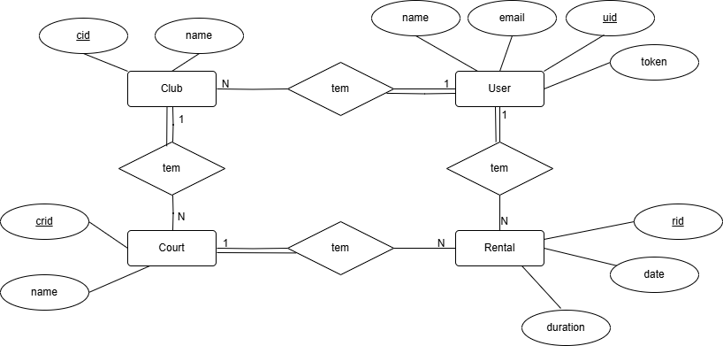

# Phase 1

## Introduction

This document contains the relevant design and implementation aspects of LS project's first phase.

## Modeling the database

### Conceptual model ###

The following diagram holds the Entity-Relationship model for the information managed by the system.

We highlight the following aspects:

Our data model consists of four entities: `User`, `Club`, `Court`, and `Rental`, each with the following attributes:

- **`User`**: `id`, `name`, `email`, `password`.
- **`Club`**: `id`, `name`, `address`.
- **`Court`**: `id`, `clubId`, `name`.
- **`Rental`**: `id`, `courtId`, `userId`, `date`.

These attributes are directly mapped to database tables.

#### Relationships

The relationships between these entities are defined as follows:

- `User` has a **one-to-many** relationship with `Club`, meaning a user can be associated multiple clubs.
- `User` has a **one-to-many** relationship with `Rental`, allowing a user to have multiple rentals.
- `Club` has a **one-to-many** relationship with `Court`, meaning a club can have multiple courts.
- `Court` has a **one-to-many** relationship with `Rental`, meaning a court can have multiple rentals.

#### Database Mapping

To map these relationships to the database, we follow the hierarchy of dependencies:

- `Club` has a foreign key `owner`, referencing the `User` entity.
- `Court` has a foreign key `club_id`, referencing the `Club` entity.
- `Rental` has foreign keys `court_id`, referencing the `Court` entity, and `renter_id`, referencing the `User` entity.

The conceptual model has the following restrictions:

* The email of a user is unique. 
* The name of a club is unique.
* The id of a court is unique.
* The id of a rental is unique.
* There's no attribute that can be null in the database.

### Physical Model ###

The physical model of the database is available in [DataBase Model](../src/test/sql/createSchema.sql).

We highlight the following aspects of this model:

* (_include a list of relevant design issues_)

## Software organization

### Open-API Specification ###

[OpenApi Specification](./openapi.yaml)

In our Open-API specification, we highlight the following aspects:

Our endpoints are organized in the following way:
* `/users` - User management
* `/clubs` - Club management
* `/courts` - Court management
* `/rentals` - Rental management

All the endpoints require authentication with a Token, except the  post  to`/users` endpoint 
that create a new user in the system. 

We also specify the actual dto classes that are used in the by our webApi.

### Request Details

The request flow in our system follows a structured pattern through several layers:

* `Web API Layer`: Receives and processes HTTP requests
* `Service Layer`: Handles business logic
* `Repository Layer`: Manages data access
* `Database`: Stores and retrieves data

The request follows this path:

* The HTTP request is received by the relevant WebApi class, where path and query parameters are extracted and validated
* Request logging, error handling and Token validation are applied through functions from the Utils Class
* The request is transformed into domain model parameters forcing rules and constraints
* The service layer is called to execute logic and interacts with repositories through transaction management
* Results are converted to DTOs and returned as HTTP responses

(_describe how and where request parameters are validated_)

### Connection Management

(_describe how connections are created, used and disposed_, namely its relation with transaction scopes).

### Data Access

The data access layer is implemented using the Repository pattern. 
The interfaces below establish the contract for the repositories:
* `UserRepository`
* `ClubRepository`
* `CourtRepository`
* `RentalRepository`

The `Transaction` interface centralizes all repositories, providing a unified access 
point for database operations. The `TransactionManager` interface manages transactions, 
offering the run method, which executes a given block of repository operations within 
a transactional context.

We have the following implementations, for the test of the data access layer:
* `UserRepositoryInMem`
* `ClubRepositoryInMem`
* `CourtRepositoryInMem`
* `RentalRepositoryInMem`

* And the following implementations, for the actual data access layer:
* `UserRepositoryJdbc`
* `ClubRepositoryJdbc`
* `CourtRepositoryJdbc`
* `RentalRepositoryJdbc`

(_identify any non-trivial used SQL statements_).

### Error Handling/Processing

Our solution handles errors as follows:

* If a client error is detected in the request, we immediately return an error response,
informing the user of the invalid request without further processing.

* If an error occurs during request processing, our service returns an error to the API,
detailing what went wrong.

* We use CustomError classes for each error type, which are converted into JSON objects
in the API and returned to the client.

## Critical Evaluation

(_enumerate the functionality that is not concluded and the identified defects_)

(_identify improvements to be made on the next phase_)